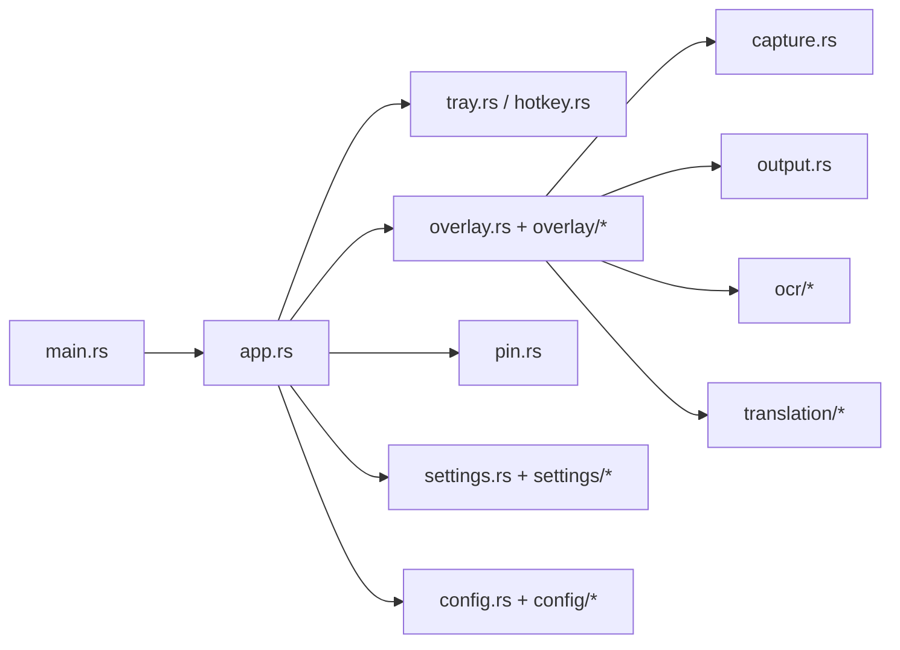

# OpenCapt

中文：[README.md](README.md)

OpenCapt is a `Windows only` screenshot tool written in Rust. The target experience is close to Snipaste / PixPin: tray-resident runtime, global hotkey capture, native annotation overlay, pin windows, OCR, and translation.

The project is already usable for daily work. It does not expose a traditional main window. The app stays in the system tray, uses a native Win32 overlay for capture and annotation, and uses `egui/eframe` for the settings window.

## Feature Highlights

- Capture: global hotkey, region selection, cancel, multi-monitor support, DPI-aware coordinates, auto copy, auto save
- Annotation: move selection, 8 resize handles, rectangle, ellipse, line, arrow, mosaic, text, numbered markers, undo
- Pin windows: multiple pinned images, drag, wheel zoom, context menu, always-on-top, border/shadow, opacity
- OCR: OpenAI Compatible OCR, Baidu OCR, block overlay, click-to-copy, copy full text
- Translation: OpenAI Compatible translation, Baidu image translation, block overlay, direct pasted translated image
- Settings: General / Annotation / Pin / OCR / Translation pages with hotkey, defaults, model management, launch at startup

## Quick Start

Make sure Rust is available in the current terminal:

```powershell
$env:PATH="$env:USERPROFILE\.cargo\bin;$env:PATH"
cargo run
```

Useful development entry points:

```powershell
cargo run -- capture-test
cargo run -- overlay-test
cargo run -- settings
```

## Packaging

Build a release package:

```powershell
.\build-release.ps1
```

Common options:

```powershell
.\build-release.ps1 -StaticCRT
.\build-release.ps1 -SkipZip
```

Default output directory:

```text
dist\
```

The release executable embeds the application icon from `assets/icons/tray.ico`.

## Configuration and Paths

OpenCapt prefers portable configuration next to `opencapt.exe`:

```text
.\config.toml
.\logs\
```

If the executable directory is not writable, for example under `Program Files`, it falls back to:

```text
%APPDATA%\OpenCapt\config.toml
%APPDATA%\OpenCapt\logs\
```

Screenshots are saved by default to:

```text
%USERPROFILE%\Pictures\OpenCapt\YYYY-MM-DD\
```

## Architecture Snapshot

OpenCapt is not a web UI and not a classic multi-window desktop app. The main runtime shape is “tray-driven app + native screenshot overlay + separate settings window”.



Key ideas:

- `main.rs` handles startup mode, config loading, and logging
- `app.rs` owns the main event loop and coordinates tray, hotkey, overlay, pin windows, and settings
- `overlay` is the core of capture, selection, annotation, and OCR/translation overlays
- `settings` is a dedicated `egui/eframe` settings window
- `ocr` and `translation` are organized around provider-based protocol adapters

## Where to Start Reading the Code

Recommended reading order for new contributors:

1. [src/main.rs](src/main.rs)
2. [src/app.rs](src/app.rs)
3. [src/overlay.rs](src/overlay.rs) and [src/overlay](src/overlay)
4. [src/settings.rs](src/settings.rs) and [src/settings](src/settings)
5. [src/config.rs](src/config.rs) and [src/config](src/config)
6. [src/ocr](src/ocr) / [src/translation](src/translation)

For a more detailed map, see [docs/en/code-map.md](docs/en/code-map.md).

## OCR and Translation Providers

Currently supported:

- OCR
  - OpenAI Compatible
  - Baidu OCR
- Translation
  - OpenAI Compatible
  - Baidu image translation

Baidu image translation supports two output paths:

- translated blocks rendered inside the overlay
- direct use of Baidu `pasteImg` output

See [docs/en/ocr-translation.md](docs/en/ocr-translation.md) for details.

## Further Reading

- [docs/en/README.md](docs/en/README.md) documentation index
- [docs/en/architecture.md](docs/en/architecture.md) runtime architecture
- [docs/en/code-map.md](docs/en/code-map.md) module and entry-point guide
- [docs/en/capture-overlay-flow.md](docs/en/capture-overlay-flow.md) capture and overlay flow
- [docs/en/ocr-translation.md](docs/en/ocr-translation.md) OCR / translation design
- [docs/en/development.md](docs/en/development.md) development and debugging guide

## Current Status

OpenCapt is already a practical Windows screenshot tool. The next high-value areas are:

- stronger image translation and text layout fidelity
- better history management
- installer, code signing, and release workflow
- more OCR / translation providers