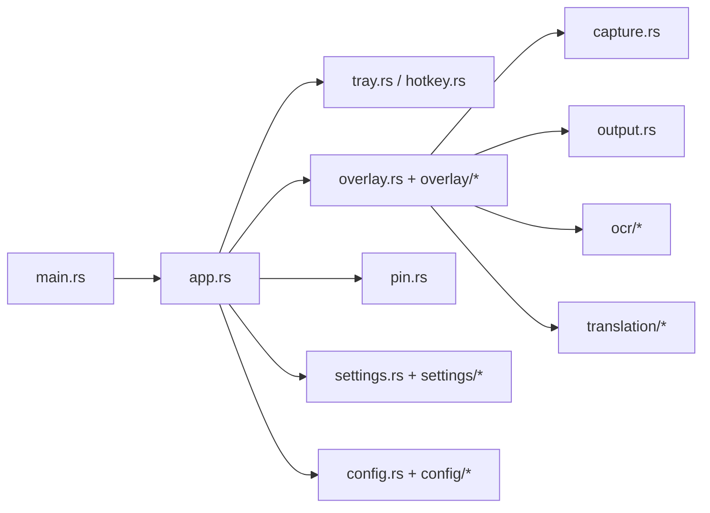

# OpenCapt

English: [README.en.md](README.en.md)

OpenCapt 是一个使用 Rust 编写的 `Windows only` 截图工具，目标体验接近 Snipaste / PixPin：常驻托盘、全局热键唤起、框选截图、原生标注、贴图、OCR 与翻译。

当前项目已经可以日常使用，主程序没有传统主窗口，运行后常驻系统托盘；截图与标注使用原生 Win32 overlay，设置窗口使用 `egui/eframe`。

## 功能概览

- 截图：全局热键、框选、取消、多显示器、非 100% 缩放对齐、自动复制、自动保存
- 标注：移动选区、八点缩放、矩形、椭圆、直线、箭头、马赛克、文字、序号、撤销
- 贴图：多张贴图并存、拖动、滚轮缩放、右键菜单、置顶、边框/阴影、不透明度
- OCR：OpenAI Compatible OCR、百度 OCR、文本块覆盖层、点击复制、复制全文、完成后自动复制
- 翻译：OpenAI Compatible 翻译、百度图片翻译、文字覆盖层、直接使用百度返回译图、完成后自动复制
- 设置：通用 / 标注 / 贴图 / OCR / 翻译 五个页面，支持热键、默认值、模型管理、开机自启

## 快速开始

确保当前终端可以直接找到 Rust：

```powershell
$env:PATH="$env:USERPROFILE\.cargo\bin;$env:PATH"
cargo run
```

常用调试入口：

```powershell
cargo run -- capture-test
cargo run -- overlay-test
cargo run -- settings
```

## 打包发布

一键打包：

```powershell
.\build-release.ps1
```

常用参数：

```powershell
.\build-release.ps1 -StaticCRT
.\build-release.ps1 -SkipZip
```

默认输出目录：

```text
dist\
```

Release exe 已嵌入应用图标，图标来源为 `assets/icons/tray.ico`。

## 配置与目录

OpenCapt 优先使用便携式配置，也就是和 `opencapt.exe` 同级：

```text
.\config.toml
.\logs\
```

如果 exe 所在目录不可写，例如位于 `Program Files`，会自动回退到：

```text
%APPDATA%\OpenCapt\config.toml
%APPDATA%\OpenCapt\logs\
```

截图默认保存到：

```text
%USERPROFILE%\Pictures\OpenCapt\YYYY-MM-DD\
```

## 架构速览

OpenCapt 不是 Web UI，也不是传统多窗口桌面程序；它的主链路是“托盘驱动 + 原生截图 overlay + 独立设置窗口”。



关键设计点：

- `main.rs` 只负责启动模式、配置加载、日志初始化
- `app.rs` 持有主事件循环，协调托盘、热键、overlay、贴图、设置窗口
- `overlay` 是截图、选区、标注、OCR/翻译覆盖层的核心
- `settings` 是独立的 `egui/eframe` 设置窗口
- `ocr` / `translation` 通过 provider 分层适配不同协议

## 从哪里开始读代码

如果你第一次接手这个仓库，建议按这个顺序看：

1. [src/main.rs](src/main.rs)
2. [src/app.rs](src/app.rs)
3. [src/overlay.rs](src/overlay.rs) 和 [src/overlay](src/overlay)
4. [src/settings.rs](src/settings.rs) 和 [src/settings](src/settings)
5. [src/config.rs](src/config.rs) 和 [src/config](src/config)
6. [src/ocr](src/ocr) / [src/translation](src/translation)

更详细的代码地图见 [docs/code-map.md](docs/code-map.md)。

## OCR 与翻译 Provider

当前支持：

- OCR
  - OpenAI Compatible
  - 百度 OCR
- 翻译
  - OpenAI Compatible
  - 百度图片翻译

其中百度图片翻译支持两条路径：

- 文字块翻译后在 overlay 中按块渲染
- 直接使用百度返回的译图 `pasteImg`

更详细说明见 [docs/ocr-translation.md](docs/ocr-translation.md)。

## 进一步阅读

- [docs/README.md](docs/README.md) 文档索引
- [docs/architecture.md](docs/architecture.md) 运行时架构
- [docs/code-map.md](docs/code-map.md) 模块与代码入口导读
- [docs/capture-overlay-flow.md](docs/capture-overlay-flow.md) 截图与 overlay 主链路
- [docs/ocr-translation.md](docs/ocr-translation.md) OCR / 翻译设计
- [docs/development.md](docs/development.md) 开发与调试说明

## 参与贡献

欢迎提交 issue、改进建议和 pull request。

- 中文贡献说明：[CONTRIBUTING.md](CONTRIBUTING.md)
- English contributing guide: [CONTRIBUTING.en.md](CONTRIBUTING.en.md)

## 当前状态

当前版本已经是一套可正常投入使用的 Windows 截图工具。后续可能会开发以下功能：

- 更强的图片翻译回填与文字排版
- 更完整的历史记录与管理
- 安装包、代码签名与正式发布流程
- 更多 OCR / 翻译 provider

## 开源许可

本项目使用 [Apache License 2.0](LICENSE) 开源。
