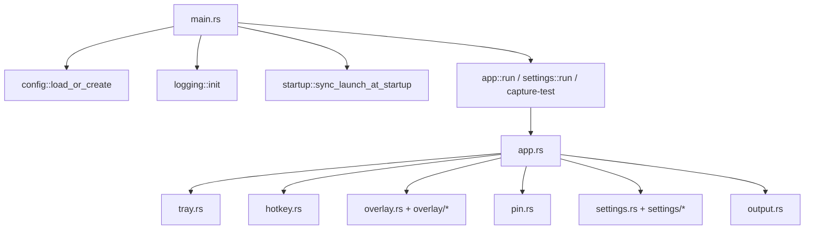

# OpenCapt 架构说明

English: [en/architecture.md](en/architecture.md)

## 总体形态

OpenCapt 不是“主窗口 + 子窗口”的传统桌面程序，而是：

- 一个常驻托盘的后台应用
- 一个按需打开的原生截图 overlay
- 一个独立的设置窗口
- 若干按需存在的贴图窗口

这套形态的目标是尽量接近 Snipaste / PixPin 这类工具的使用方式：平时不打扰，触发时马上进入截图与标注流。

## 运行时结构

关键点：

- `main.rs` 只负责启动模式分发，不承担业务状态机
- `app.rs` 是主运行时协调层，持有事件循环和应用状态
- `overlay` 承担截图交互、标注编辑、OCR/翻译覆盖层
- `settings` 只承担设置窗口，不参与截图主链路
- `pin.rs` 是和截图主链路并行的贴图窗口系统

## 为什么是这套结构

### 托盘常驻

截图工具的主入口应该是：

- 系统托盘
- 全局热键

因此主程序常驻但不显示主窗口更合理，用户也更容易形成稳定心智模型。

### 原生 overlay

截图时最重视的是：

- 唤起速度
- DPI 对齐
- 原生鼠标交互
- 对截图结果的精细控制

所以 OpenCapt 保留了原生 Win32 layered window 的 overlay 链路，而不是把截图层也迁到常规 GUI 窗口框架里。

### 独立设置窗口

设置页面本身更适合用 `egui/eframe` 这种桌面 UI 快速实现。它和截图 overlay 的交互模型完全不同，因此拆成独立窗口能减少耦合。

## 核心模块职责

### `app`

- 创建 `tao` 事件循环
- 初始化托盘和全局热键
- 接收 overlay 完成/取消信号
- 管理设置窗口、贴图窗口和配置热重载

### `overlay`

- 管理截图底图与选区
- 处理鼠标和键盘输入
- 绘制工具栏、控制点和标注对象
- 发起 OCR / 翻译后台请求
- 生成最终导出图或贴图图像

### `config`

- 配置类型定义
- 兼容老配置结构
- 便携式路径与 `%APPDATA%` 回退策略
- 读写 `config.toml`

### `ocr` / `translation`

- 统一请求入口
- 对不同 provider 做协议适配
- 统一结果模型或归一化逻辑

## 当前技术栈的边界

- `tao`：事件循环与托盘/热键主线程组织
- Win32 layered window：截图 overlay 与贴图
- `egui/eframe`：设置窗口
- `xcap`：抓屏
- `reqwest`：OCR / 翻译接口调用
- `serde + toml`：配置

这套组合的关键不是“库多”，而是每种库都只承担一类明确职责。