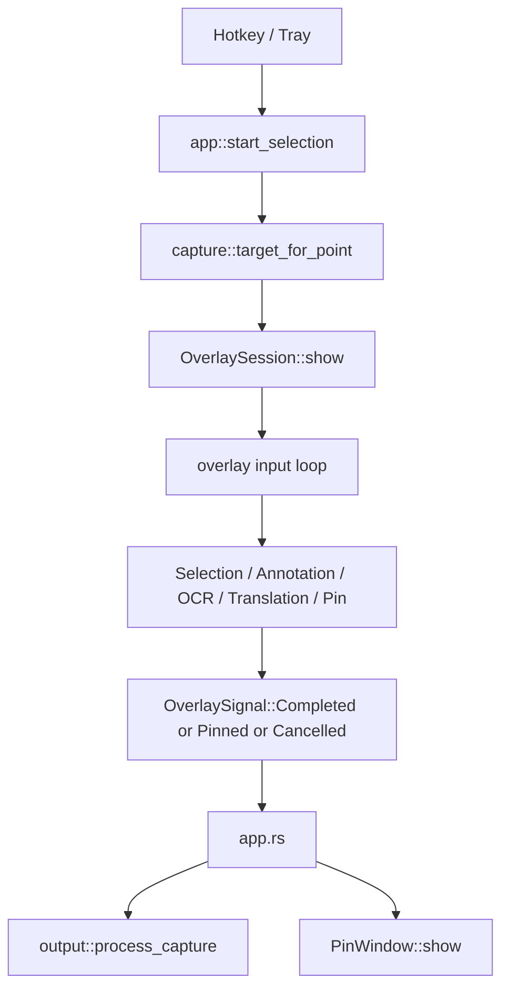

# 截图与 Overlay 主链路

English: [en/capture-overlay-flow.md](en/capture-overlay-flow.md)

## 总览

OpenCapt 的截图流程不是“直接截图后立刻保存”，而是：

1. 触发截图
2. 抓取当前显示器底图
3. 进入 overlay 框选
4. 在选区内进行标注 / OCR / 翻译 / 贴图决策
5. 最终确认后导出图像

这也是为什么项目需要长期持有当前截图底图，而不是每一步都重新抓屏。

## 事件流

## 触发入口

截图可以来自：

- 全局热键
- 托盘菜单
- 调试入口 `overlay-test`

这些入口最终都会回到 `app.rs` 里的同一套状态机，而不会走几套不同逻辑。

## 抓屏与目标显示器

截图时不是直接抓整套虚拟桌面，而是先确定“当前鼠标所在显示器”，然后只抓这一块屏幕。

这样做有几个好处：

- 多显示器逻辑更稳定
- DPI 处理更清晰
- 框选和最终区域截图都更容易对齐

## Overlay 阶段

overlay 内部同时承担三类职责：

### 1. 选区控制

- 鼠标拖拽创建选区
- 八个控制点调整大小
- 移动整个选区
- `Esc` 取消

### 2. 标注编辑

- 图形工具切换
- 对象创建、选择、移动、缩放
- 文字编辑
- 撤销

### 3. 附加能力

- OCR：发起识别并显示文本块
- 翻译：发起翻译并显示译文块或直接译图
- 贴图：将当前结果转成独立 pin window

## 为什么导出时还要重新生成图片

overlay 期间屏幕上看到的是“底图 + 暗层 + 选区 + 工具条 + 编辑态”的组合，不是最终导出图。

最终确认时，程序会重新基于：

- 原始选区图像
- 当前标注对象
- OCR / 翻译覆盖结果

生成一张真正用于：

- 剪贴板
- PNG 保存
- 贴图窗口

的图像。

这也是为什么工具栏、控制点、暗层这些不会进入最终截图。

## 贴图分支

如果用户选择贴图而不是普通输出，overlay 不会直接结束成 PNG，而是把结果图像和屏幕坐标打包交给 `pin.rs`。

`pin.rs` 再创建独立 layered window，实现：

- 拖动
- 滚轮缩放
- 右键菜单
- 置顶 / 装饰 / 不透明度控制

## 理解 Overlay 代码的关键

阅读 overlay 代码时，最重要的是把它拆成三层看：

- 状态：当前选区、工具、对象、编辑态
- 输入：鼠标和键盘如何改变状态
- 渲染：当前状态如何变成窗口画面和最终导出图

不要把它当作一个“7 千行大文件”，而要把它当作一个截图编辑子系统。