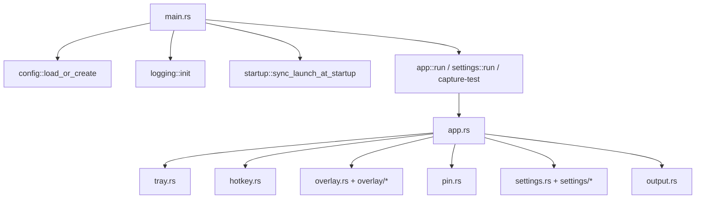

# OpenCapt Architecture

中文：[../architecture.md](../architecture.md)

## Overall Shape

OpenCapt is not a classic “main window + child windows” desktop app. It is composed of:

- a tray-resident background app
- a native screenshot overlay opened on demand
- a dedicated settings window
- multiple optional pin windows

This shape matches the expected workflow of tools like Snipaste / PixPin: stay out of the way until capture starts, then enter a focused screenshot and annotation flow immediately.

## Runtime Structure

Key points:

- `main.rs` only handles startup-mode dispatch
- `app.rs` owns the runtime coordination and event loop
- `overlay` owns capture interaction, annotation editing, and OCR/translation overlays
- `settings` only owns the settings window
- `pin.rs` is a parallel subsystem for pinned image windows

## Why This Structure

### Tray-first runtime

The natural entry points of a screenshot utility are:

- system tray
- global hotkey

So the app is designed to stay resident without showing a main window.

### Native overlay

The capture layer prioritizes:

- wake-up speed
- DPI alignment
- native mouse interaction
- precise control over the final screenshot

That is why OpenCapt keeps a native Win32 layered-window overlay instead of moving capture interaction into a generic GUI framework.

### Separate settings window

The settings UI is a better fit for `egui/eframe`. Its interaction model is completely different from the capture overlay, so keeping it separate reduces coupling.

## Core Module Responsibilities

### `app`

- creates the `tao` event loop
- initializes tray and global hotkey
- receives overlay completion/cancel signals
- manages settings window, pin windows, and config hot reload

### `overlay`

- manages screenshot background and selection
- handles mouse and keyboard input
- draws toolbar, handles, and annotation objects
- launches OCR / translation background tasks
- generates final export images or pinned images

### `config`

- configuration types
- backward compatibility for old config shapes
- portable vs `%APPDATA%` path resolution
- `config.toml` load and save

### `ocr` / `translation`

- expose unified request entry points
- adapt provider-specific protocols
- normalize results into overlay-friendly shapes

## Technology Boundaries

- `tao`: event loop and tray/hotkey host thread
- Win32 layered window: overlay and pin windows
- `egui/eframe`: settings window
- `xcap`: screen capture
- `reqwest`: OCR / translation network calls
- `serde + toml`: configuration

The important design choice is not the number of libraries, but that each library only owns one clear responsibility.