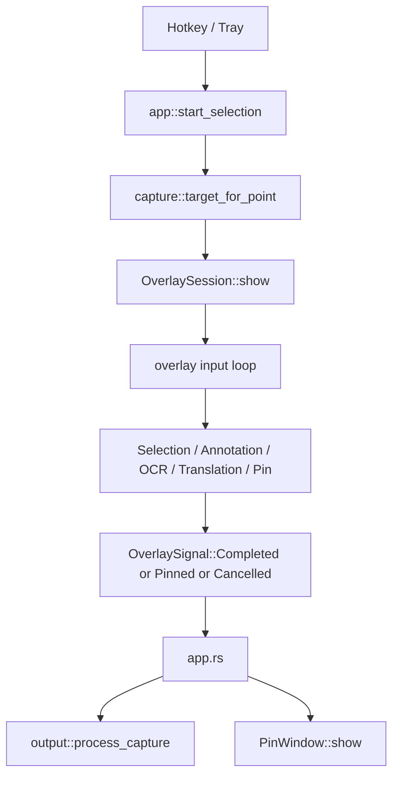

# Capture and Overlay Flow

中文：[../capture-overlay-flow.md](../capture-overlay-flow.md)

## Overview

OpenCapt does not simply capture and save immediately. The flow is:

1. trigger capture
2. capture the current monitor background
3. enter the overlay selection stage
4. annotate / OCR / translate / pin inside the selection
5. export the final image on confirmation

This is also why the project keeps the current screenshot background in memory while the overlay is active instead of re-capturing the screen at every step.

## Event Flow

## Trigger Entry Points

Capture can start from:

- the global hotkey
- the tray menu
- the `overlay-test` debug mode

All of them converge into the same runtime state machine in `app.rs`.

## Screen Capture and Monitor Targeting

OpenCapt does not capture the entire virtual desktop first. It first resolves the monitor under the cursor and captures that monitor only.

Benefits:

- simpler multi-monitor behavior
- clearer DPI handling
- better alignment between selection and final region output

## Inside the Overlay

The overlay owns three major responsibilities at once.

### 1. Selection control

- drag to create selection
- resize with 8 handles
- move the full selection
- cancel with `Esc`

### 2. Annotation editing

- switch tools
- create, select, move, and resize objects
- edit text
- undo

### 3. Extended actions

- OCR: run recognition and show text blocks
- Translation: run translation and show translated blocks or a pasted translated image
- Pin: convert the current result into a standalone pin window

## Why Export Rebuilds the Image

What you see during overlay interaction is a composition of:

- screenshot background
- dimmed outside area
- current selection
- toolbar
- editing UI

That is not the final exported image.

On confirmation, OpenCapt rebuilds the export from:

- the original selection image
- current annotation objects
- OCR / translation overlay results

This is why toolbars, handles, and dimming never appear in the saved screenshot.

## Pin Branch

If the user chooses pinning instead of normal output, the overlay produces an image plus screen coordinates and hands that payload to `pin.rs`.

`pin.rs` then creates a separate layered window with:

- drag
- wheel zoom
- context menu
- always-on-top / decoration / opacity control

## The Right Way to Read Overlay Code

The overlay should be read as three layers:

- state: selection, tools, objects, edit modes
- input: how mouse and keyboard mutate the state
- rendering: how state becomes window pixels and final exported images

It is much easier to reason about the subsystem this way than as a single very large file.