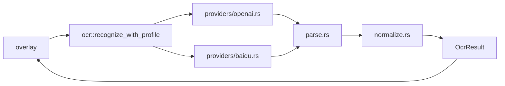
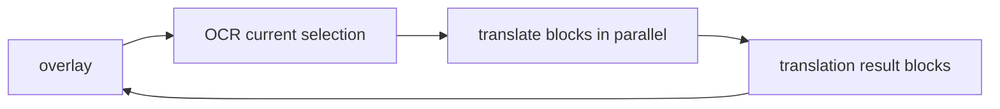
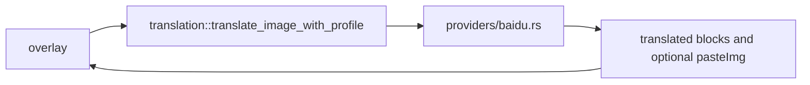

# OCR and Translation Design

中文：[../ocr-translation.md](../ocr-translation.md)

## Overall Idea

OpenCapt does not hard-code OCR or translation into a single cloud API. Both features are organized around provider layers:

- upper layers decide what to request and what result shape they need
- provider layers adapt specific protocols

This allows new OCR or translation services to be added without rewriting overlay logic.

## OCR Structure

Currently supported OCR providers:

- OpenAI Compatible OCR
- Baidu OCR

The unified output model is built around:

- `full_text`
- `blocks`
- normalized bbox values for each block

The bbox normalization step is critical because different models return different coordinate systems.

## bbox Normalization

Current OCR coordinate modes:

- `0~1`
- `0~999`
- `0~1000`
- `PixelAbsolute`

Provider-specific raw coordinates are normalized before they reach overlay logic. This lets overlay work with a single consistent coordinate model.

## Translation Structure

Translation currently has two paths.

### OpenAI Compatible Translation

Characteristics:

- OCR first, then translate block by block
- behaves like a translated text-block overlay
- fits the existing interaction model, but is not true image-level translation replacement

### Baidu Image Translation

This path does not require a local OCR pre-step because the Baidu image translation API can already return:

- translated text blocks
- an optional directly translated image `pasteImg`

## Two Overlay Display Modes

### Text-block overlay

Used for:

- OCR result display
- OpenAI Compatible translation
- Baidu image translation when `pasteImg` is not used

Characteristics:

- keeps one consistent interaction model
- allows click-to-copy on blocks
- coexists naturally with annotation tools

### Direct translated image

Used for:

- Baidu image translation with “prefer translated image output” enabled

Characteristics:

- the overlay does not locally render translated text block by block
- it displays the translated image returned by Baidu
- this is closer to image-level translation replacement

## Why Provider Layering Matters

OCR and translation protocols differ a lot:

- OpenAI Compatible uses a chat-completions style API
- Baidu OCR requires token auth plus a dedicated OCR endpoint
- Baidu image translation uses a different image translation protocol

If those protocol details were embedded directly in overlay logic, the screenshot editing layer would become tightly coupled to network details.

## Where to Start When Adding a Provider

- OCR: start with `src/ocr/mod.rs` and `src/ocr/providers/*`
- Translation: start with `src/translation/mod.rs` and `src/translation/providers/*`
- if the provider introduces a new coordinate system or result shape, then inspect normalization and parse modules