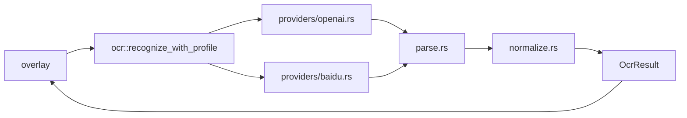
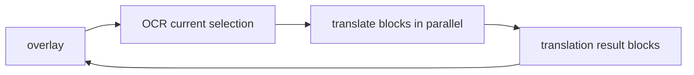
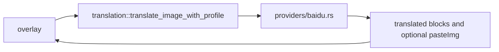

# OCR 与翻译设计

English: [en/ocr-translation.md](en/ocr-translation.md)

## 总体思路

OpenCapt 的 OCR 和翻译不是直接写死某一个云接口，而是走 provider 分层：

- 上层只关心“请求什么”和“返回什么”
- 下层 provider 负责适配不同协议

这样后续扩展新的 OCR 或翻译服务时，不需要把 overlay 逻辑一起重写。

## OCR 结构

OCR 当前支持：

- OpenAI Compatible OCR
- 百度 OCR

统一输出的核心是：

- `full_text`
- `blocks`
- 每个 block 的标准化 bbox

其中 bbox 标准化很关键，因为不同模型返回的坐标系并不一致。

## bbox 归一化

当前 OCR 支持这些坐标模式：

- `0~1`
- `0~999`
- `0~1000`
- `PixelAbsolute`

provider 返回原始坐标后，会先进入统一归一化流程，再交给 overlay 使用。这样 overlay 只需要处理一种标准化结果。

## 翻译结构

翻译有两条路径。

### OpenAI Compatible 翻译

这条路径的特点：

- 先 OCR，再逐块翻译
- 更像“文字块覆盖层”
- 适合统一交互模型，但不是图片级别回填

### 百度图片翻译

这条路径不需要先走本地 OCR，因为百度接口本身就能直接处理图片翻译并返回：

- 翻译后的文本块
- 可选的直接译图 `pasteImg`

## Overlay 中的两种显示方式

### 文字块覆盖层

适用于：

- OCR 结果显示
- OpenAI Compatible 翻译
- 百度图片翻译但未使用 `pasteImg`

特点：

- 保持统一交互方式
- 可以点击块复制文本
- 更容易和标注编辑共存

### 直接使用译图

适用于：

- 百度图片翻译开启“直接使用译图”

特点：

- 不再本地逐块绘制译文
- 直接显示百度返回的译后图像
- 更接近“图片级翻译回填”

## 复制全文与自动退出

OCR 和翻译设置页分别提供“完成后自动复制全文”和“复制全文后自动退出截图”。
自动复制默认关闭，复制后退出默认开启。两个选项相互独立：关闭自动复制后，
手动点击 overlay 中的“复制全文”仍会在复制成功后退出。退出后，当前屏幕底部会短暂显示
“复制成功”提示；无可复制文本或剪贴板写入失败时不会退出。

## 为什么要保留 provider 分层

因为 OCR 和翻译的协议差异非常大：

- OpenAI Compatible 走 `chat/completions` 风格
- 百度 OCR 先鉴权，再调用 OCR 接口
- 百度图片翻译是另一套图片翻译协议

如果这些逻辑直接写进 overlay，就会让截图编辑层和网络协议层彻底耦合。

## 新增 provider 时建议看哪里

- OCR：先看 `src/ocr/mod.rs`、`src/ocr/providers/*`
- 翻译：先看 `src/translation/mod.rs`、`src/translation/providers/*`
- 如果是新坐标系或新结果形态，再看归一化与解析模块
